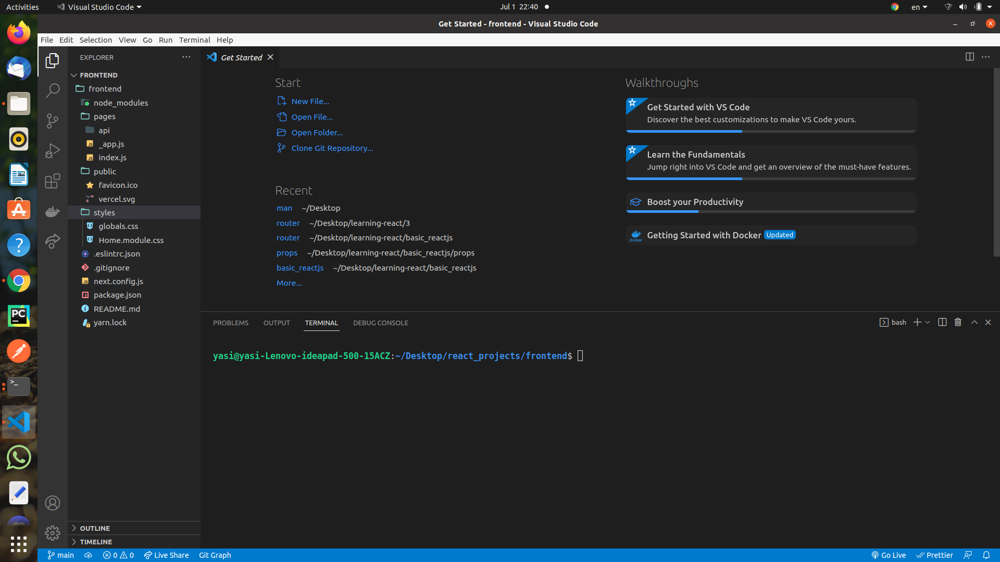
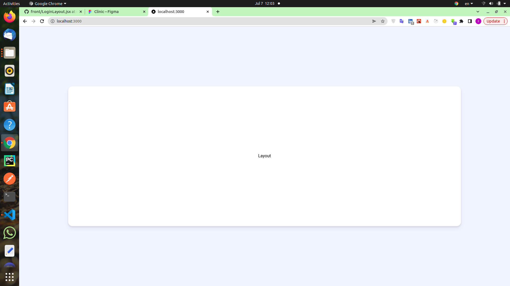
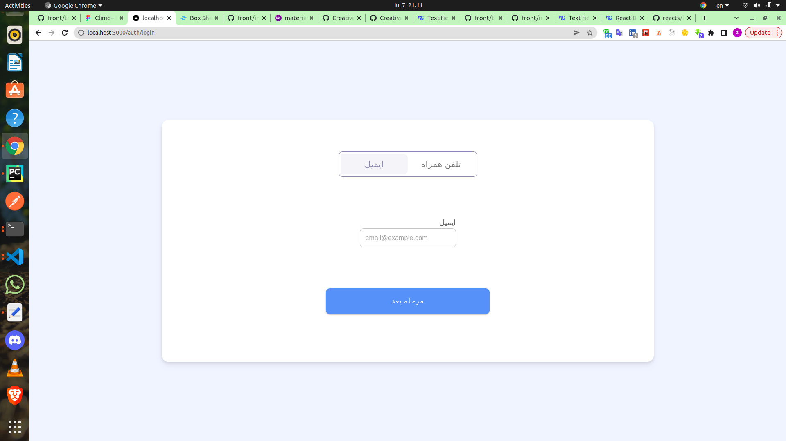
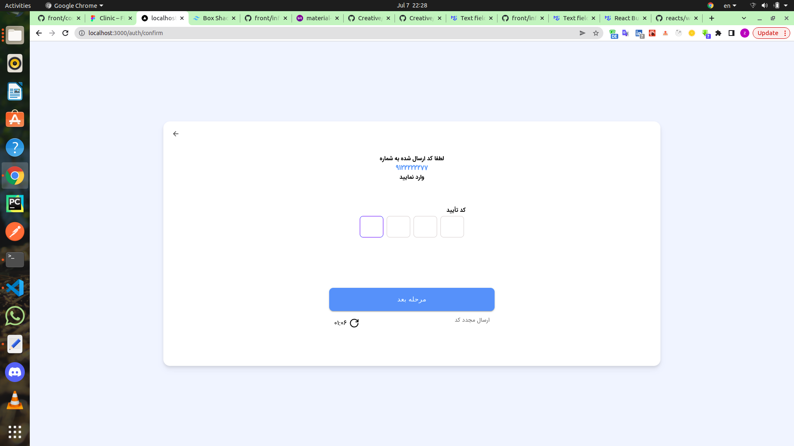

### install

```jsx
npx create-next-app frontend
npm run dev

```



#### Installing mui

[mui](https://mui.com/material-ui/getting-started/installation/)

```jsx
cd frontend

npm install @mui/material @emotion/react @emotion/styled @emotion/server @emotion/cache

* @mui/material
* @emotion/react
* @emotion/server
* @emotion/styled
* @emotion/cache
```

#### How to use Material-UI with Next.js ?

[material-ui-with-next-js](https://www.geeksforgeeks.org/how-to-use-material-ui-with-next-js/)
[Next.Js + MUI v5 tutorial](https://dev.to/hajhosein/nextjs-mui-v5-tutorial-2k35)

##### Step 1: Create a custom file /pages/\_document.js

##### Step 2: Create an lib folder, add theme.js and createEmotionCache.js

```jsx
// theme.js
import { createTheme } from '@mui/material/styles';
import { red } from '@mui/material/colors';

// Create a theme instance.
const theme = createTheme({
    palette: {
        primary: {
            main: '#556cd6',
        },
        secondary: {
            main: '#19857b',
        },
        error: {
            main: red.A400,
        },
    },
});

export default theme;
//createEmotionCache.js
import createCache from '@emotion/cache';

export default function createEmotionCache() {
    return createCache({ key: 'css', prepend: true });
}
```

##### Step 3: Update the file /pages/\_app.js

#### import '../styles/globals.scss'; (npm i sass)

```jsx
// import '../styles/globals.css'
import "../styles/globals.scss";
// import 'tailwindcss/tailwind.css';
import theme from "../lib/theme";
import createEmotionCache from "../lib/createEmotionCache";
import { CacheProvider } from "@emotion/react";
import { ThemeProvider } from "@mui/system";

const clientSideEmotionCache = createEmotionCache();

function MyApp({
  Component,
  pageProps,
  emotionCache = clientSideEmotionCache,
}) {
  const getLayout = Component.getLayout ?? ((page) => page);
  return (
    <CacheProvider value={emotionCache}>
      <ThemeProvider theme={theme}>
        {getLayout(<Component {...pageProps} />)}
      </ThemeProvider>
    </CacheProvider>
  );
}

export default MyApp;
```

##### Step 4: Update the file /pages/index.js

```jsx
import Head from "next/head";
import styles from "../styles/Home.module.css";

export default function Home() {
  return (
    <div className={styles.container}>
      <Head>
        <title>Create Next App</title>
        <link rel="icon" href="/favicon.ico" />
      </Head>

      <main className={styles.main}>
        <h1 className={styles.title}>
          Welcome to <a href="https://nextjs.org">Next.js!</a> integrated with{" "}
          <a href="https://mui.com/">Material-UI!</a>
        </h1>
        <p className={styles.description}>
          Get started by editing{" "}
          <code className={styles.code}>pages/index.js</code>
        </p>
      </main>
    </div>
  );
}
```

##### Steps to run the application: To run the app, type the following command in the terminal.

```jsx
npm run dev

out => Welcome to Next.js! integrated with Material-UI!
```

#### eslint config

```jsx
{
	"env": {
		"browser": true,
		"es6": true
	},
	"extends": [
		"eslint:recommended", "plugin:react/recommended", "next",
		"next/core-web-vitals", "airbnb"
	],
	"settings": {
		"react": {
			"version": "detect"
		}
	},
	"parserOptions": {
		"ecmaFeatures": {
			"jsx": true
		},
		"ecmaVersion": 2018,
		"sourceType": "module"
	},
	"plugins": [
		"react"
	],
	"rules": {
		"react/react-in-jsx-scopre": "off"
	}
}


```

#### Install Tailwind CSS with Next.js

[Install Tailwind CSS with Next.js](https://tailwindcss.com/docs/guides/nextjs)

```jsx
// install
npm install -D tailwindcss postcss autoprefixer
// create postcss.config.js
npx tailwindcss init -p
```

###### tailwind.config.js

```jsx
// tailwind.config.js
module.exports = {
  content: [
    "./pages/**/*.{js,ts,jsx,tsx}",
    "./components/**/*.{js,ts,jsx,tsx}",
  ],
  theme: {
    extend: {},
  },
  plugins: [],
};
```

###### Add the Tailwind directives to your CSS

```jsx
// globals.css
@tailwind base;
@tailwind components;
@tailwind utilities;

```

###### Start using Tailwind in your project

```jsx
// index.js
export default function Home() {
  return <h1 className="text-3xl font-bold underline ">Hello world!</h1>;
}
```

##### add fonts

```jsx
1_puplic/fonts
2_styles/_fonts.scss
3_styles/globals.scss
@import "fonts";
html,
body {
  height: 100%;
  padding: 0;
  margin: 0;

  font-family: "IRANSansMobile" !important;
  @screen md {
    font-family: "IRANSans" !important;
  }
}
```

```jsx
4_
// tailwind.config.js
 extend: {
      fontFamily: {
        iranSansWeb: 'iranSansWeb',
        iranSansMobile: 'iranSansMobile',
        iranSansLight: 'iranSansLight',
        iranSansBold: 'iranSansBold',
        hack: 'HACK',
        hackwin: 'HACKWIN',
        anonymice: 'anonymice',
        anonymiceWin: 'anonymice-win',
      },}
```

```jsx
// test
//index.js
<h1 className="text-3xl font-bold underline bg-secondary font-['hackwin']">
                   Hello world!
</h1>
// console.log
.font-\[\'hackwin\'\] {
    font-family: 'hackwin';
}
```

##### add ar config

```jsx
// next.config.js
/** @type {import('next').NextConfig} */
const nextConfig = {
  reactStrictMode: true,
  reactStrictMode: true,
  i18n: {
    // These are all the locales you want to support in
    // your application
    locales: ["ar"],
    // This is the default locale you want to be used when visiting
    // a non-locale prefixed path e.g. `/hello`
    defaultLocale: "ar",
    // This is a list of locale domains and the default locale they
    // should handle (these are only required when setting up domain routing)
    // Note: subdomains must be included in the domain value to be matched e.g. "fr.example.com".
    // domains: [
    //   {
    //     domain: 'example.com',
    //     defaultLocale: 'en-US',
    //   },
    // ],
  },
};

module.exports = nextConfig;

//
// pages/_document.js
// Done! (with install mui)
```

##### globals.scss

```jsx
#__next {
  height: 100%;
  width: 100vw;
}
```

#### add svg config

```jsx
npm i @svgr/webpack
```

```jsx
// next.config.js
/** @type {import('next').NextConfig} */
const path = require("path");

const nextConfig = {
  reactStrictMode: true,
  sassOptions: {
    includePaths: [path.join(__dirname, "node_modules")],
  },
  i18n: {
    // These are all the locales you want to support in
    // your application
    locales: ["ar"],
    // This is the default locale you want to be used when visiting
    // a non-locale prefixed path e.g. `/hello`
    defaultLocale: "ar",
    // This is a list of locale domains and the default locale they
    // should handle (these are only required when setting up domain routing)
    // Note: subdomains must be included in the domain value to be matched e.g. "fr.example.com".
    // domains: [
    //   {
    //     domain: 'example.com',
    //     defaultLocale: 'en-US',
    //   },
    // ],
  },
  exclude: /\.svg$/,
  poweredByHeader: false,
  inlineImageLimit: false,
  webpack: (config) => {
    config.module.rules.push({
      test: /\.svg$/,
      issuer: {
        and: [/\.(js|ts)x?$/],
        // test: /\.(js|ts)x?$/,
      },
      use: [
        {
          loader: "@svgr/webpack",
          options: {
            prettier: false,
            svgo: true,
            titleProp: true,
          },
        },
      ],
    });
    return config;
  },
};

module.exports = nextConfig;
```

#### layout

`pages/_app.js`

[layout nextjs](https://nextjs.org/docs/basic-features/layouts#per-page-layouts)

```jsx
export default function MyApp({ Component, pageProps }) {
  // Use the layout defined at the page level, if available
  const getLayout = Component.getLayout || ((page) => page);

  return getLayout(<Component {...pageProps} />);
}
```

`index.js`

```jsx
import Head from "next/head";
import LoginLayout from "../components/LoginLayout";

export default function Home() {
  return (
    <div className="flex flex-col items-center  h-full justify-center">
      <h1>Layout</h1>
    </div>
  );
}

//getLayout
Home.getLayout = (page) => <LoginLayout> {page}</LoginLayout>;
```

`components/LoginLayout.jsx`

```jsx
//imrc
import React from "react";
import ArrowBackRoundedIcon from "@mui/icons-material/ArrowBackRounded";
import { useRouter } from "next/dist/client/router";

//sfc
const LoginLayout = (props) => {
  const { children, backlink } = props;
  const router = useRouter();
  return (
    // flex flex-col w(center) => items-center
    // flex flex-col h(center) => justify-center dosent work then => h-full justify-center
    //min-h-screen	=> min-height: 100vh;
    //overflow-y-auto overflow-x-hidden
    //bg-background
    <div className="flex flex-col items-center  h-full justify-center min-h-screen  overflow-y-auto overflow-x-hidden bg-background  ">
      {/* // flex flex-col  w-[80%] h-[33rem] or h-auto desktop=> relative, mobile=> absoulte*/}

      <div className="flex flex-col w-[90%] h-[80%] md:w-[65%] md:h-[70%]  bg-white drop-shadow-lg rounded-b-none md:rounded-b-[16px] rounded-[16px] border-[#f4f5f8] absolute top-[20%] left-[5%] right-[5%] md:relative md:top-[0] md:left-0 md:right-0">
        {/* absolute mobile =>  top-[10px] left-[10px], desktop =>md:top-[20px] md:left-[20px] */}
        <ArrowBackRoundedIcon
          className={
            backlink
              ? "text-[18px] md:text-[20px] fill-darkgray  absolute  top-[10px] left-[10px] md:top-[20px] md:left-[20px]"
              : "hidden"
          }
          onClick={() => router.back()}
        />
        {children}
      </div>
    </div>
  );
};

export default LoginLayout;
```



### add back icons to layout

```jsx
1- npm i react-icons
2- npm i @mui/icons-material
3- import ArrowBackRoundedIcon from "@mui/icons-material/ArrowBackRounded";
4- const { children, backlink } = props;
5-  <ArrowBackRoundedIcon  className={backlink ? "" : "hidden"}  />
6- Utilities for styling the fill of SVG elements.=> fill-darkgray
7-
//index.js
//props => backlink
//getLayout
Home.getLayout = (page) => <LoginLayout backlink> {page}</LoginLayout>;


```

### add router link

```jsx
1-import { useRouter } from "next/dist/client/router";
2-const router = useRouter();
3- <ArrowBackRoundedIcon  className={backlink ? "" : "hidden"}  onClick={() => router.back()} />
```

### login

`http://localhost:3000/auth/login`

###### state

```jsx
//state
// ToggleButtonGroup,ToggleButton,InputLabel
const [state, setState] = useState("email");
// TextField
const [value, setValue] = useState();
```

### button (mui)

```jsx
import { Button } from "@mui/material";
//1
//w-full sm:w-auto
  <div className="w-full sm:w-auto">
        <Button
          variant="contained"
          className="w-full sm:w-auto py-3 px-18 sm:px-32"
          onClick={() =>submit()}
        >
          مرحله بعد
        </Button>
 </div>
 //2 w-[240px] md:w-[400px]
  <div className="flex flex-col mb-12">
        <Button
          variant="contained"
          className="w-[240px] md:w-[400px] h-[3.5em] rounded-[10px] p-3 text-[15px] bg-primary"
          color="primary"
          onClick={submit}
        >
          مرحله‌ بعد
        </Button>
 </div>
 // add bg-primary to className  or lib/theme.js define primary
//tailwind.config.js
//  corePlugins: {
  //    preflight: false,
  //  },

```

##### point (btn)

[point](https://tailwindcss.com/docs/preflight)

```jsx
1. add bg-primary or lib/theme.js define primary
//tailwind.config.js
2.  corePlugins: {
     preflight: false,
   },
```

###### mui (login page)

```jsx
ToggleButtonGroup, ToggleButton, InputLabel;
TextField;
```

#### utils (login page)

```jsx
// Whatever was not a number ([^\d]), replace it with an empty string.
export const preventLettersTyping = (x) => x.replace(/[^\d]/g, "");
// arabic & persion
export const persianToEnglishDigits = (digit) =>
  String(digit)
    .replace(/[٠-٩]/g, (d) => "٠١٢٣٤٥٦٧٨٩".indexOf(d))
    .replace(/[۰-۹]/g, (d) => "۰۱۲۳۴۵۶۷۸۹".indexOf(d));
```

##### newVal.splice is not a function

This error occurs because ToggleButtonGroup expects its state to be an array of all the selected buttons.
In order to make it so that only one item can be selected at a time, add `exclusive` prop to ToggleButtonGroup.

Note: If you're using `(e, value)` remember that value can be null if an item is selected twice. So we use `val && setState...` to ensure that if val is null/undefined/empty we don't change the state.

```jsx
        <ToggleButtonGroup
          ...
          exclusive
          // onChange={(e) => setState(e.target.value)}
          //or
          onChange={(e, val) => val && setState(val)}
          value={state}
        >
```

##### Removing ToggleButton borderradius

Mui ToggleButtonGroup uses an external class to change borderRadius for its children. In order to override it we need to use !important in our styles:

```jsx
  <ToggleButton
    sx={{

      borderWidth: 0,

    }}
    ...
```

##### flex

```jsx
<div className="flex flex-col items-center justify-center  relative -top-[10px] h-full">
  <div className="flex items-center justify-center "></div>

  {/* label,input */}
  <div className="flex flex-row justify-around my-[80px]">
    <div className="flex flex-col items-center py-5  w-full "></div>
  </div>

  {/* btn */}
  <div className="flex flex-col mb-[20px] ">
    <Button>مرحله‌ بعد</Button>
  </div>
</div>
```

```jsx
<div className="flex flex-col items-center justify-around h-full">
  <div className="flex items-center justify-center pt-12">
  </div>
  <div className="flex flex-row justify-around ">
  </div>
  <div className="flex flex-col pb-12 "><div className="flex flex-col pb-12 ">
  </div>
</div>
```



#### confirm

```jsx
<div class="flex flex-col  items-center justify-around grow">
  <div className="flex flex-col items-center pt-12">
    لطفا کد ارسال شده به شماره ...
  </div>

  <div className="flex flex-col mt-3 items-center justify-around grow  ">
    <div className="flex flex-col ">
      <VerificationInput />
    </div>

    <div className="m-3 flex  flex-row justify-between">
      <Button />
    </div>
  </div>
</div>
```

###### VerificationInput

```jsx
// state
const [code, setCode] = useState("");
//
npm i react-verification-input
//
const CODE_LENGTH = 4;
//
 <VerificationInput
            length={CODE_LENGTH}
            placeholder=""
            validChars="0-9۰-۹"
            onChange={() =>{}}
            removeDefaultStyles
            autoFocus
            dir="ltr"
            classNames={{
              container: `flex flex-row justify-center h-[45px] w-[200px] md:w-[260px] md:h-[50px]`,
              character: `flex justify-center items-center rounded-lg m-1 border border-border border-solid `,
              characterInactive: `rounded-lg m-1 border border-border `,
              characterSelected: `rounded-lg m-1 border border-borderColor  `,
            }}
          />
        </div>
```

##### Timer

In order to create a countdown timer we need to use setInterval and change our time(which is a state) every second

```jsx
//state
const timerRef = useRef(null); // kind of like a pointer to a value
const [time, setTime] = useState(120);
```

We use timerRef to save the setInterval value so that we can erase it later.

Refs in js are like pointers, in order to access their value we use .current.

```jsx
const startTimer = () => {
  if (timerRef.current) clearInterval(timerRef.current); // Clear previous set interval (if exists)
  const timerInterval = setInterval(() => {
    // Create a new interval
    if (time > 0) setTime((t) => (t > 0 ? t - 1 : t));
    else clearInterval(timerRef.current); // Clear the interval if time === 0
  }, 1000);
  timerRef.current = timerInterval; // Save timerInterval to timerRef so that it can be erased later
};
```

setState syntax with function:
Usually we use setState(newvalue) to update our state. But if our current state depends on its previous value we can use the following syntax

```jsx
setState((previous_value) => {
  const new_value = previous_value * 2;
  return new_value;
});

const getNewValue = (previous) => previous - 1;
setState(getNewValue);
```

##### useEffect hook to stop/start timer

```jsx
useEffect(() => {
  // use effect body is componentDidMount
  // it runs when component initially renders in page or when page loads for the first time
  startTimer(); // Start time on page load
  return () => {
    // return should be a function
    // use effect return body is componentDidUnmount
    // it runs when component gets removed from the page or page gets closed
    if (timerRef.current) clearInterval(timerRef.current); // if page is closing and timer is running, stop it
  };
}, []);
```

```jsx
//
useEffect(() => {
  startTimer();
  // unmount
  return () => {
    if (timerRef.current) clearInterval(timerRef.current);
  };
}, []);
```

#### refresh

```jsx
<div className="flex items-center ">
  <GrRefresh className="w-[25px] h-[25px] p-[5px]" />
  {/* 90/60 = 1.5 => floor(1.5) -> 1 =>str(1)=>'1 */}
  {/* '1'.padStart(2, '0') = '01' */}
  {String(Math.floor(time / 60)).padStart(2, "0")}:{/*90 %60 =>30 =>'30' =>   */}
  {/* 01:30*/}
  {String(time % 60).padStart(2, "0")}
</div>
```



###### MainLayout

```jsx
//MainLayout
<aside className="hidden md:flex flex-col basis-[240px]">
  <NavigationBar isOpen={open} willClose={() => setOpen(false)} />
</aside>
```

##### NavigationBar

```jsx
const navs = [
  //doctors,pharmacy,laboratory
  [
    {
      name: "پزشکان",
    },
    {
      name: "داروخانه‌",
    },
    {
      name: "آزمایشگاه",
    },
  ],
  //visits,
  [
    {
      name: "ویزیت‌ها",
    },
  ],
  //transactions,profile
  [
    {
      name: "تراکنش‌ها",
    },
    {
      name: "  ناحیه کاربری",
    },
  ],
  //support
  [
    {
      name: " پشتیبانی",
    },
  ],
];
//
<div className="flex flex-col">
  {navs.map((navin) => (
    <>
      {navin.map((nav) => (
        <Link key={nav.name} href={nav.link}>
          <a>
            {nav.path.test(router.asPath)}
            <nav.icon className="text-xs w-[1rem] h-[1rem]  [&>*]:stroke-[0.3px] stroke-[0.3px] mr-4 ml-2" />
            {nav.name}
          </a>
        </Link>
      ))}
      <Divider className="w-[60%] self-center " />
    </>
  ))}
</div>;

//add SwipeableDrawer
import {
  Divider,
  SwipeableDrawer,
  useMediaQuery,
  useTheme,
} from "@mui/material";
const isMobile = useMediaQuery(theme.breakpoints.down("md"));
<SwipeableDrawer
  anchor={isMobile ? "bottom" : "right"}
  open={isOpen}
  onClose={willClose}
  variant={isMobile ? "temporary" : "permanent"}
  sx={{
    "& .MuiDrawer-paper": {
      borderLeft: "0",
      [theme.breakpoints.down("md")]: {
        borderTopLeftRadius: "1em",
        borderTopRightRadius: "1em",
      },
      [theme.breakpoints.up("md")]: {
        width: "240px",
      },
    },
  }}
></SwipeableDrawer>;
```

#### redux

```jsx
npm i redux react-redux
next => npm i next-redux-wrapper
async func => npm i redux-thunk @reduxjs/toolkit
persist => npm i redux-persist
```

```jsx
reducer => state,action { type, payload }
combineReducer from type recognize which reducer(func) should be called
```

`lib/store.js`

```jsx
server =>


  if (isClient) {
    use LocalStorage and redux persist

    const { persistReducer } = require('redux-persist');
    const storage = require('redux-persist/lib/storage').default;

    // const composeEnhancers = window.__REDUX_DEVTOOLS_EXTENSION_COMPOSE__ || compose;

...

      const persistConfig = {
      key: 'root',
      storage,
    };

    const persistedReducers = persistReducer(persistConfig, rootReducer); // Wrapper reducers: if incoming actions are persist actions, run persist commands otherwise use rootReducer to update the state

    store = configureStore({
      reducer: persistedReducers, preloadedState: initialState, middleware: (getDefaultMiddleware) => getDefaultMiddleware({ serializableCheck: false }).concat(thunk), devTools: { shouldStartLocked: false },
    });

    store.__PERSISTOR = persistStore(store);
  }
  else{

  dont use LocalStorage and redux persist
  above code removed

  }
```

`_app.js`

```jsx
import { useStore } from 'react-redux';
import { wrapper } from '../lib/store'

function MyApp(...) {
  ...
  const store = useStore();

  ...
  return (
     <PersistGate persistor={store.__PERSISTOR} loading={null}>
    ....
    </PersistGate>
  )
}
export default wrapper.withRedux(MyApp)

```

##### install axios

`lib/axios.js`

```jsx
npm i axios axios-auth-refresh
lib/axios.js
//_app.js
setupInterceptors(store);
```

```jsx
import axios from "axios";
import createAuthRefreshInterceptor from "axios-auth-refresh";

const axiosInstance = axios.create({
  withCredentials: true,
  headers: {
    common: {
      "Accept-Language": "ir",
    },
  },
});

export const setupInterceptors = (store) => {
  createAuthRefreshInterceptor(
    axiosInstance,
    (failedRequest) =>
      axiosInstance
        .post("/api/auth/refresh/", {
          user_id: store.getState().authReducer?.username,
          refresh: store.getState().authReducer?.refreshToken,
        })
        .then((resp) => {
          const { access_tok: accessToken } = resp.data;
          const bearer = `${
            process.env.JWT_AUTH_HEADER ?? "Bearer"
          } ${accessToken}`;
          console.log(accessToken);
          axiosInstance.defaults.headers.common.Authorization = bearer;

          failedRequest.response.config.headers.Authorization = bearer;
          return Promise.resolve();
        }),
    { statusCodes: [401, 403] }
  );
};

// Create axios interceptor
export default axiosInstance;
```

#### addd backend

`next.config.js`

```jsx
const nextConfig = {
  async rewrites() {
    return [
      {
        source: '/api/:path*/',
        destination: `${process.env.BACKEND_BASE_URL}/api/:path*/`,
      },
    ];
  },
  .
  .
  .
  }
```

`url backend`

```jsx
//ivisit/urls.py
urlpatterns = [
    path('admin/', admin.site.urls),
    path('api/auth/',include('authentication.urls')),
    path('api/data/', include('constant_data.urls')),
    path('api/patients/', include('patients.urls')),
    # path('api/visits/', include('visits.urls')),
    # path('api/doctors/', include('doctors.urls')),
]

```

`.env`

```jsx
BACKEND_BASE_URL=http://localhost:8000
JWT_AUTH_HEADER=Bearer
```

##### LoginLayout

```jsx
// const { children, backlink } = props;
// <ArrowBackRoundedIcon  onClick={() => router.back()}/>

const LoginLayout = (props) => {
  const { children, backlink } = props;
  const router = useRouter();
  return (
    <div className="flex flex-col fixed">
      <div className="flex flex-col">
        <ArrowBackRoundedIcon
          className={
            backlink
              ? "text-[18px] absolute  top-[10px] left-[10px] md:top-[20px] md:left-[20px]"
              : "hidden"
          }
          onClick={() => router.back()}
        />
        {children}
      </div>
    </div>
  );
};

export default LoginLayout;
```

#### MainLayout

```jsx
import React, { useState, useRef } from "react";
import NavigationBar from "./NavigationBar";
import Header from "./Header";
import MobileFooter from "./MobileFooter";

const MainLayout = (props) => {
  const [open, setOpen] = useState(false);
  const { children } = props;
  return (
    <div className="flex flex-row w-full relative h-full bg-white  overflow-y-auto">
      {/* aside*/}
      <aside className="hidden md:flex flex-col basis-[240px]">
        <NavigationBar isOpen={open} willClose={() => setOpen(false)} />
      </aside>
      {/* Header,main */}
      <div className="flex flex-col flex-grow overflow-hidden">
        {/* ? */}
        <Header openNavBar={() => setOpen(true)} />
        <main>{children}</main>
        {/*md:hidden MobileFooter */}
        <MobileFooter />
      </div>
    </div>
  );
};
export default MainLayout;

//header => state => true or false
// const [open, setOpen] = useState(false);
//MainLayout
// <Header openNavBar={() => setOpen(true)} />
//Header
// <CgMenuGridR onClick={openNavBar}/>
<<<<<<< HEAD

=======
   
>>>>>>> d10a94c9be6a7b4c6dc1b7d2161f7b62b910066b
import { CgMenuGridR } from "react-icons/cg";

const Header = (props) => {
  const { openNavBar } = props;
  return (
    <nav
      className={`flex flex-row-reverse `}
    >
    .
    .
    .
    <CgMenuGridR
      className={`flex md:hidden w-[1.5rem] h-[1.5rem] m-1`}
      onClick={openNavBar}
    />
    </nav>
  );
};
export default Header;


```
<<<<<<< HEAD

#### Layout mobile

`components/Header.jsx`
`components/MainLayout.jsx => add <MobileFooter/>`
`components/MobileFooter.jsx`
`components/NavigationBar.jsx`
`components/PatientSelection.jsx`

```jsx

//desktop
const Header = (props) => {
  const { openNavBar } = props;
  return (
    <nav
      className={`flex flex-row-reverse items-center  h-[65px] p-1 md:pl-20 md:h-[70px] border-0 border-b border-solid border-lightgray`}
    >
      <PatientSelection />
      <div className="flex md:hidden ">
        {/* <MainIcon alt="کینیک غدد" className='md:justify-self-center md:self-center ' /> */}
      </div>
      <div className="d-flex flex-row mr-0 md:mr-[1em]">
        <NotificationComponent />
        <CgMenuGridR className="flex md:hidden " onClick={openNavBar} />
      </div>
    </nav>
  );
};
export default Header;
//mobile and desktop
- components/Header.jsx

//components/NavigationBar.jsx
 {
      name: "پزشکان",
      className: "hidden md:flex",
 },
 {
      name: "داروخانه‌",
      className: "hidden md:flex",
 },
 {
      name: "آزمایشگاه",
      className: "hidden md:flex",
 },
 [theme.breakpoints.down("md")]: {

            margin: "0 10px",
 },
 <PatientSelection/>
 //add  ${nav.className}
 <Link key={nav.name} href={nav.link}>
    <a className={`${nav.path.test(router.asPath)? " ": " "} ${nav.className}`} > </a>
   
</Link>
<Divider className="w-[60%] self-center first-of-type:hidden md:first-of-type:flex" />

//components/PatientSelection.jsx
//Menu
[theme.breakpoints.down("md")]: {
              position: "fixed",
              width: "auto",
              bottom: "0 !important",
              left: "5% !important",
              right: "5% !important",
              top: "unset !important",
              borderBottomLeftRadius: "0",
              borderBottomRightRadius: "0",
            },
```
=======
>>>>>>> d10a94c9be6a7b4c6dc1b7d2161f7b62b910066b
