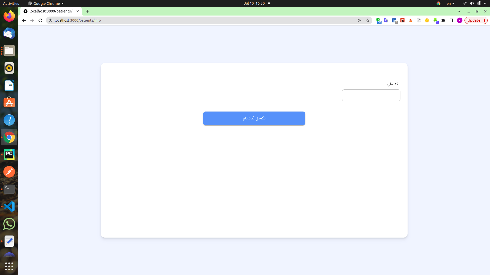

### install

###### patients/index.jsx

```jsx
//patients/index.jsx
npm i next-router
import { useRouter } from 'next/router';
const [selectedPatient, setSelectedPatient] = useState();
// { [1, 2, 3].map((id) => (<Button> {id} </Button>)) }

 {[1, 2, 3].map((id) => (
          <Button
            variant="outlined"
            className="m-3 w-[240px] md:w-[366px] h-[3em]  rounded-lg border-size-[2px] text-xl text-semibold"
            sx={{
              borderWidth: "2px",
              borderColor:
                id === selectedPatient
                  ? theme.palette.primary.main
                  : theme.palette.border.main,
              orderWidth: id === selectedPatient ? "2px" : "1px",
            }}
            onClick={() => setSelectedPatient(id)}
          >

            {id}
          </Button>
        ))}
```

###### Patients flex

```jsx
//patients/index.jsx
const Patients = () => {
  const [selectedPatient, setSelectedPatient] = useState();
  const theme = useTheme();
  const router = useRouter();
  return (
    <div className="flex flex-col items-center justify-center ">
      <div className="flex flex-row"></div>
      <div className="flex flex-col"></div>
      <div className="flex flex-row items-center justify-center mb-10 mt-6"></div>
    </div>
  );
};
export default Patients;
//Layout
Patients.getLayout = (page) => <LoginLayout>{page}</LoginLayout>;
```

###### Patients and mui

```jsx
const Patients = () => {
  const [selectedPatient, setSelectedPatient] = useState();
  const theme = useTheme();
  const router = useRouter();
  return (
    <div className="flex flex-col items-center justify-center grow mt-5">
      <div className="flex flex-row">
        <p></p>
      </div>
      <div className="flex flex-col mt-5">
        {[1, 2, 3].map((id) => (
          <Button> {id} </Button>
        ))}
        <Button variant="contained"> بیمار جدید </Button>
      </div>
      <div className="flex flex-row items-center justify-center mb-10 mt-6">
        <Button variant="contained"> مرحله بعد </Button>
      </div>
    </div>
  );
};
export default Patients;
//Layout
Patients.getLayout = (page) => <LoginLayout>{page}</LoginLayout>;
```


###### patients/new.jsx

`state`

```jsx
// nationalId
// const nationalId = useRef();
const [nationalId, setnationalId] = useState();
// birthdate
const [birthdate, setBirthDate] = useState();
```

`label=> InputLabel`

```jsx
//mui
label=> InputLabel
//label
 <label className="form-label" htmlFor="nationalId">
            کدملی
</label>
//InputLabel
   <InputLabel
          htmlFor="nationalId"
          sx={{
            color: theme.palette.textBlack.main,
            width: "100%",
            textAlign: "right",
            marginBottom: 1 / 2,
          }}
        >
          کد ملی
 </InputLabel>
```

`input => TextField`

```jsx
//nui
input => TextField
//input =>
   <input
    dir="ltr"
    id="nationalId"
    // ref={nationalId}
    className="form-control"
    maxLength={10}
    inputMode="numeric"
    value={nationalId}
    onChange={(e) => {
     setnationalId(e.target.value);
     setNationalIdValid(e.target.value.length === 10);
     }}

  />
//
 <TextField
  dir="ltr"
  id="nationalId"
  className="w-full"
   inputProps={{
    maxLength: 10,
    inputMode: "numeric",
   }}
  variant="outlined"
  autoComplete="none"
  required
  value={nationalId}
   onChange={(e) => {
     setnationalId(preventLettersTyping(persianToEnglishDigits(e.target.value)));
     setNationalIdValid(e.target.value.length === 10);
     }}
  error={idErr}
   />

```

##### DatePicker

`DatePicker.jsx`

```jsx
npm i moment-jalaali
import DatePicker from '../../components/DatePicker';

//ref
import React, { useState, useEffect, useRef } from 'react';
  // birthdate
const [birthdate, setBirthDate] = useState();
const btnRef = useRef();
<DatePicker value={birthdate} onChange={setBirthDate} btnRef={btnRef} editable />

```

###### patients/info.jsx

```jsx
//PatientInfo
const PatientInfo = () => {
  const [state, setState] = useState({});
  //flex-row flex-wrap
  return (
    <div className="d-flex flex-row flex-wrap p-3  mt-12">
      {FIELDS.map((field, i) => {
        return <FormControlLabel />;
      })}
    </div>
  );
};
export default PatientInfo;
//Layout
PatientInfo.getLayout = (page) => <LoginLayout>{page}</LoginLayout>;
```

###### PatientInfo

```jsx
component: TextField =>national_id,first_name,last_name
component: MultiSelect => gender,insurance,hasSupIns
(options => gender,insurance,hasSupIns)
component: InputCityComponent=>province,city
(type =>province,city )
component: MultiSelectBackend => supplementary_insurance
```

```jsx
const FIELDS = [
  {
    id: "national_id",
    label: "کد ملی",
    editable: true,
    component: TextField,
    disabled: () => true,
  },
];
//PatientInfo
const PatientInfo = () => {
  //state
  const [state, setState] = useState({});
  //flex-row flex-wrap
  return (
    <div className="d-flex flex-row flex-wrap p-3  mt-12">
      {FIELDS.map((field, i) => {
        return <FormControlLabel />;
      })}
    </div>
  );
};
export default PatientInfo;
//Layout
PatientInfo.getLayout = (page) => <LoginLayout>{page}</LoginLayout>;
```



`state info page`

```jsx
//state[field.id]
value={state[field.id]}
//setState({ ...state, [field.id]: e.target.value })
 onChange={(e) => {setState({ ...state, [field.id]: e.target.value }); }}


//
const FIELDS = [
  {
    id: 'national_id',
    label: 'کد ملی',
    editable: true,
    component: TextField,
    disabled: () => true,
  },
]
const [state, setState] = useState({});
{FIELDS.map((field, i) => {
        return (
          <FormControlLabel
            //field.component
            control={
              <field.component
                value={state[field.id]}
                onChange={(e) => {
                  setState({ ...state, [field.id]: e.target.value });
                }}
                options={field.options}
              />
            }

          />)})}
```

```jsx
const FIELDS = [
  {
    id: "national_id",
    label: "کد ملی",
    editable: true,
    component: TextField,
    disabled: () => true,
  },
];
//PatientInfo
const PatientInfo = () => {
  const [state, setState] = useState({});
  return (
    <div className="d-flex flex-row flex-wrap p-3  mt-12">
      {/* {FIELDS.map((field, i) => {return ( <FormControlLabel />); })} */}

      {/*field  map*/}
      {FIELDS.map((field, i) => {
        return (
          <FormControlLabel
            labelPlacement="top"
            sx={{
              alignItems: "start",
            }}
            className="my-1"
            // field.id
            key={field.id}
            //field.label
            label={field.label}
            //field.component
            control={
              <field.component
                value={state[field.id]}
                onChange={(e) => {
                  setState({ ...state, [field.id]: e.target.value });
                }}
                options={field.options}
              />
            }
          />
        );
      })}
    </div>
  );
};
export default PatientInfo;
//Layout
PatientInfo.getLayout = (page) => <LoginLayout>{page}</LoginLayout>;
```

`FormControlLabel => FormControl`

```jsx
<FormControl required={field.required} key={field.id}>
  {/*star */}
  <FormLabel>{field.label}</FormLabel>
  <field.component
    state={state}
    value={state[field.id]}
    onChange={(e) => {
      setState({ ...state, [field.id]: e.target.value });
    }}
    fieldData={field}
  />
</FormControl>
```

###### MultiSelect component

```jsx
function MultiSelect(props) {
  const { options, value: value1, onChange } = props;
  return (
    <Select
      value={value1}
      onChange={onChange}
      //  {...props}
      sx={{
        width: "100%",
      }}
    >
      {options?.map((item) => (
        <MenuItem value={item.id}>{item.name}</MenuItem>
      ))}
    </Select>
  );
}

const FIELDS = [
  {
    id: "gender",
    label: "جنسیت",
    required: true,
    editable: false,
    component: MultiSelect,
    options: [
      {
        id: "f",
        name: "زن",
      },
      {
        id: "m",
        name: "مرد",
      },
    ],
  },
];

const PatientInfo = () => {
  const theme = useTheme();
  //state
  const [state, setState] = useState({});

  return (
    <div className="d-flex flex-row flex-wrap p-3  mt-12">
      {/*field  map*/}
      {FIELDS.map((field, i) => {
        return (
          <FormControl required={field.required} key={field.id}>
            <FormLabel>{field.label}</FormLabel>
            <field.component
              state={state}
              value={state[field.id]}
              onChange={(e) => {
                setState({ ...state, [field.id]: e.target.value });
              }}
              fieldData={field}
              options={field.options}
            />
          </FormControl>
        );
      })}
    </div>
  );
};
export default PatientInfo;
//Layout
PatientInfo.getLayout = (page) => <LoginLayout>{page}</LoginLayout>;
```
##### propTypes

```jsx
import PropTypes from "prop-types";

MultiSelect.propTypes = {
  options: PropTypes.arrayOf(
    PropTypes.shape({
      name: PropTypes.string,
      id: PropTypes.any,
    }),
  ),
  value: PropTypes.any,
  onChange: PropTypes.func,
};

```